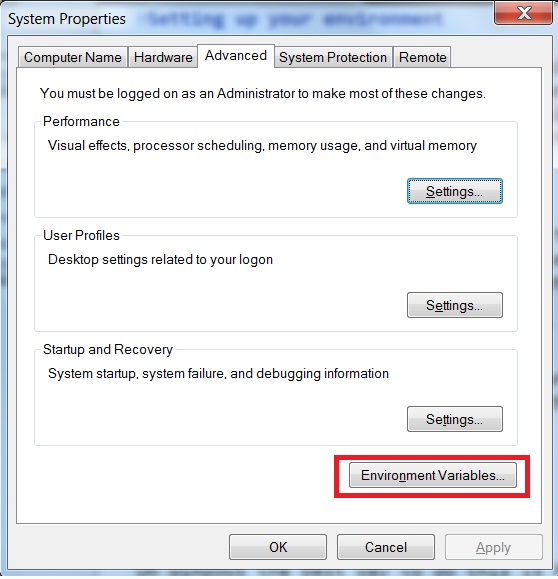
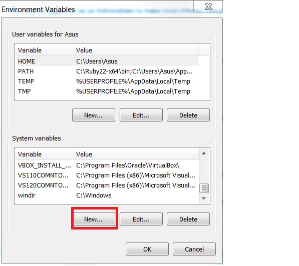
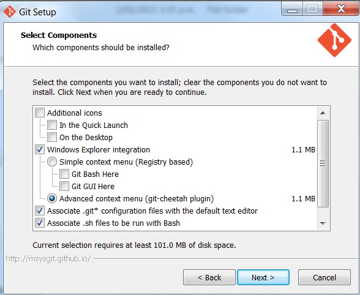
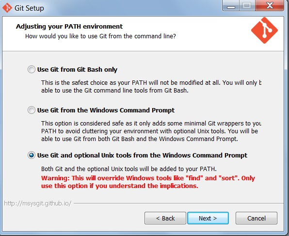
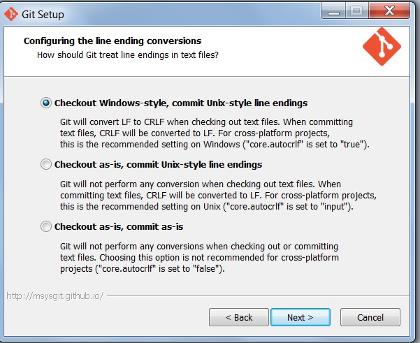

#Setting up your environment

- [Setting your HOME variable](#setting-your-home-variable)
- [Installing Git](#installing-git)
- [Installing Node.js](#installing-nodejs)

There are plenty of gotchas and pain points getting up and running with a modern web app using tools like node.js, bower and yeoman on Windows because most of these tools have originally been developed by people using `nix systems. I am going to focus on setup for Windows initially and add steps for other systems in the future.

##Setting your HOME variable

This is an important step for various tools that expect to have this variable by default. To set an environment variable in Windows hit the start button and start typing 'Environment' and you should get an item:

'Edit the system environment variables'

NOTE: I tend to just set the system variable as then its global but it you have multiple user accounts you may want to select the other option for 'Edit the environment variables for you account'.

On the window that opens press 'Evironment variables':



On the next screen if there is not a variable called 'HOME' in the system variables section click 'new'.



Under variable name type 'HOME' and under variable value add the directory you wish to use. I tend to use the root of my user directory e.g.:

C:/users/{user-name}/

That way I can set up a directory there such as 'C:/users/{user-name}/dev' for all my repositories.

Now to test this try opening a command window and typing:

``` Batchfile
cd %HOME%
```

If you directory changed to the directory set in the previous step then you have successfully set up your HOME variable.

##Installing Git

Git is a distributed version control system that is extremely popular and most (if not all) of the libraries and packages we are going to use are publicly available as git repositories on [Github.com](https://github.com).

*NOTE: If you already have it installed I would highly recommend uninstalling and following the steps below. There are a few different ways to install git and this is the way I have found best for Windows environments.*

Start by installing mysysgit which is the Windows version of git by visiting [http://msysgit.github.io/](http://msysgit.github.io/)

Follow the wizard using the following settings:

1. Components:
Default is fine here but configure as you please.



2. Adjusting you path environment

In this step I recommend selecting the 3rd option to add git and optional unix style commands to your PATH variable. If you do have a reason not to do this then I will try to guide you where there might be issues with regular Windows settings.



3. Check-in style

Leave this as the default




You can verify your install by running cmd and entering the command:

```Batchfile
git --version
```

This prints out the version of git you have installed. At the time of this tutorial being last tested this was the output:

```Batchfile
git version 1.9.5.msysgit.1
```

###Getting started with Git

Git has great documentation that can be found [here](http://git-scm.com/doc) as well as a 'Getting Started - First-Time Git Setup'  article [here](http://git-scm.com/book/en/v2/Getting-Started-First-Time-Git-Setup). However I am going to detail the steps I recommend taking.

####Setting up a local user for Git

You need to set up a local user with an email address. To do this type:

```
git config --global user.name "{your-name}"
git config --global user.email your-name@your-domain.com
```

Verify this by typing the command:

```
git config --list
```

####Setting up ssh key with Github account

*NOTE: If you haven't got a GitHub user account then visit this link and set it up [https://github.com/join](https://github.com/join)*

Although you can acess GitHub through https sometimes you want to use ssh. To set up an ssh key enter the commands:

```
cd %HOME%
mkdir .ssh
ssh-keygen -t rsa -C "your_email@example.com"
```

Now that the public key is generated open the file in notepad by running the command:

```
notepad id_rsa.pub
```

This file is your public key used to identify yourself with GitHub. Copy the whole contents of the file to your clipboard and log into GitHub. Go to your account settings by clicking on your user name in the top right corner. Click 'Edit profile' and click 'ssh keys' in the sidebar. Add an ssh key enter a name, I just use my computer name, and paste the contents of your public key. Now you have set up ssh with your GitHub. You can test this by running:

```
ssh -T git@github.com
```

You will be promted to enter your password and get a success/failure message.

##Installing Node.js

On windows the best way to do this is by downloading the node installer from [NodeJS.org](https://nodejs.org/). Follow all the default steps and this should get you up and running.

The Windows installer only hast he node version from when the latest build was. Update your install by navigating to your
NodeJS folder (usually in C:\Program Files (x86)\nodejs) and entering the command:

```
npm install --global npm@latest
```

The reason for navigating to the folder is because otherwise you can run into issues with it updating in your AppData folder and not in the global node modules area. If you have any warning about missing dependencies such as:

```
npm WARN unmet dependency C:\Users\Asus\node_modules\bower\node_modules\p-thrott
ler requires q@'~0.9.2' but will load
```

Then just run this command with each package it mentions starting from the bottom most package:

```
npm install -g package-name@version-number
```

Try running the original command to update to the latest npm between each new package install you do. Once you stop getting those dependency errors you can move on.

Verify your node installation by opening a cmd window and typing:

```
node --version && npm --version
```

Upon writing this tutorial the output was:
```
v0.12.2
2.7.4
```


###Node Package Manager
Node Package Manager (npm) is used to get and update packages for your site. I will explain more in later section but for now we are going to download some packages that we are going to use later.

To install all the packages enter the following command:

```
npm install --g yo@1.4.6 bower@1.4.1 grunt-cli@0.1.13
```

Using the npm install command with a global (-g) flag we have installed 3 packages at once in our global environment:

- [Bower](http://bower.io)
- [AngularJS](http://angularjs.org)
- [Yeoman](http://yeoman.io)

I have deliberately got you to install the exact version in order to make sure this tutorial works as expected. I will try to keep these numbers as up to date as possible however.

**[Back to README](README.md)**
