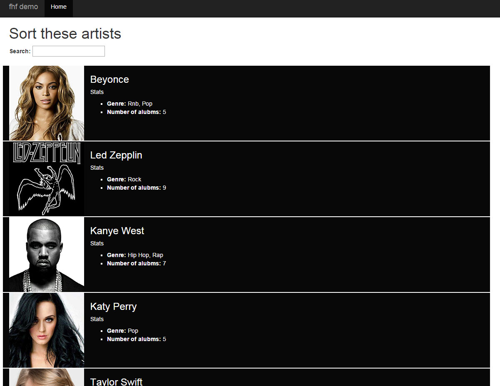

#Getting Started

If you haven't already you will need to get the source files by cloning this repo:

```
git clone https://github.com/justsayno/fhf-demo.git
```

You directory should look something like this:


NOTE: For this demo I am going to keep things simple in terms of structuring the project. There are many approaches and arguments to be had about this and the way I present in this demo is by no means the ideal one. The purpose of this tutorial is to introduce the main concepts of AngularJS, not to go into the details of developing production applications.

To run the application and see what we have enter the command:

``` sh
    npm start
```

This will run a local server in that servers files from the "app" subdirectory. This is where all the files for our application go. Don't worry about any "peerDependencies" or similar errors in your console when you run `npm start` this is fine. Open a new terminal/cmd and navigate to the root of you project again.  Visit the following link in the browser to see what we are starting with:

`http://localhost:8000/app/index.html`




##The basics

While this looks okay at the moment we have just got hard coded html. We can take advantage of Angular's databinding to retrieve this data using a service. In this example I am going to use a mock service to make the code simpler. Before we do this I need to explain some of the basics of angular.

Everything you create in Angular needs to be attached to a "module". To create a module you simply give it a name and an array of dependencies. For now we don't have any dependencies so create a folder `scripts` in your `app` folder and then create a file `app.js` that looks like this:

```javascript
angular.module('app', []);
```

Once you have registered and app you do what is called "bootstrapping" which can be done a few ways but in this tutorial we are going to look at the method of adding an ng-app attribute to an element on your html page:

(from the top of index.html)
```html
<html lang="en" class="no-js" ng-app="app">
```

This basically launches our Angular app in the browser and tells the framework what parts of our html it should be parsing. So far the app does nothing more than what it was doing when it was simple static html. In the next section we are going to add a controller and do some data binding.

NOTE: This is valid HTML5 however if you want you can use any Angular attribute with a `data-` prefix. E.g. `data-ng-app="app"`.

We might as well add some references to our project now as well. We are going to add jQuery and angularJS and then also the reference to our app.js.

```
<!-- bower_components -->
<script src="bower_components/jquery/dist/jquery.js"></script>
<script src="bower_components/angular/angular.js"></script>
<!-- bower_components -->

<!-- app-->
<script src="scripts/app.js"></script>
<!-- app -->
```

Here is a listing of the whole of index.html, a simple static html page at this point:

```
<!DOCTYPE html>
<html lang="en" class="no-js" ng-app="app">
<head>
  <meta charset="utf-8">
  <meta http-equiv="X-UA-Compatible" content="IE=edge">
  <title>My AngularJS App</title>
  <meta name="description" content="">
  <meta name="viewport" content="width=device-width, initial-scale=1">
  <link rel="stylesheet" href="/app/bower_components/bootstrap/dist/css/bootstrap.css">
  <link rel="stylesheet" href="styles/app.css">
</head>
<body>

 <nav class="navbar navbar-inverse navbar-fixed-top">
      <div class="container">
        <div class="navbar-header">
          <button type="button" class="navbar-toggle collapsed" data-toggle="collapse" data-target="#navbar" aria-expanded="false" aria-controls="navbar">
            <span class="sr-only">Toggle navigation</span>
            <span class="icon-bar"></span>
            <span class="icon-bar"></span>
            <span class="icon-bar"></span>
          </button>
          <a class="navbar-brand" href="#">fhf demo</a>
        </div>
        <div id="navbar" class="collapse navbar-collapse">
          <ul class="nav navbar-nav">
            <li class="active"><a href="#">Artists</a></li>
          </ul>
        </div><!--/.nav-collapse -->
      </div>
    </nav>

    <div class="container">
        <h1>Artists</h1>
        <ul class="artist-list">
              <li class="artist-item row">
                    <div class="artist-image col-sm-2">
                        
                    </div>
                    <div class="artist-detail col-sm-10">
                        <h3 class="artist-name">Beyonce</h3>
                        <h5>Stats</h5>
                        <ul class="artist-stats">
                          <li><strong>Genre: </strong>
                              <ul>
                                  <li>Rnb</li>
                                  <li>Pop</li>
                              </ul>
                          </li>
                          <li><strong>Number of albums:</strong> 5</li>    
                        </ul>
                    </div>
              </li>
              <li class="artist-item row">
                  <div class="artist-image col-sm-2">
                      
                  </div>
                  <div class="artist-detail col-sm-10">
                      <h3 class="artist-name">Led Zepplin</h3>
                      <h5>Stats</h5>
                      <ul class="artist-stats">
                        <li><strong>Genre: </strong>Rock</li>
                        <li><strong>Number of albums:</strong> 
                              <ul>
                                  <li>Rock</li>
                              </ul>
                        </li>    
                      </ul>
                  </div>
              </li>
              <li class="artist-item row">
                  <div class="artist-image col-sm-2">
                      
                  </div>
                  <div class="artist-detail col-sm-10">
                      <h3 class="artist-name">Kanye West</h3>
                      <h5>Stats</h5>
                      <ul class="artist-stats">
                        <li><strong>Genre: </strong>
                              <ul>
                                  <li>Hip Hop</li>
                                  <li>Rap</li>
                              </ul>
                        </li>     
                        <li><strong>Number of albums:</strong> 7</li>    
                      </ul>
                  </div>
              </li>
              <li class="artist-item row">
                  <div class="artist-image col-sm-2">
                      
                  </div>
                  <div class="artist-detail col-sm-10">
                      <h3 class="artist-name">Katy Perry</h3>
                      <h5>Stats</h5>
                      <ul class="artist-stats">
                        <li><strong>Genre: </strong>
                              <ul>
                                  <li>Pop</li>
                              </ul>
                        </li> 
                        <li><strong>Number of albums:</strong> 5</li>    
                      </ul>
                  </div>
              </li>
              <li class="artist-item row">
                  <div class="artist-image col-sm-2">
                      
                  </div>
                  <div class="artist-detail col-sm-10">
                      <h3 class="artist-name">Taylor Swift</h3>
                      <h5>Stats</h5>
                      <ul class="artist-stats">
                        <li><strong>Genre: </strong>
                              <ul>
                                  <li>Pop</li>
                                  <li>Country</li>
                              </ul>
                        </li> 
                        <li><strong>Number of albums:</strong> 5</li>    
                      </ul>
                  </div>
              </li>
          </ul>

    </div><!-- /.container -->

    <!-- bower_components -->
        <script src="bower_components/jquery/dist/jquery.js"></script>
    <script src="bower_components/angular/angular.js"></script>
    <!-- bower_components -->

    <!-- app-->
    <script src="scripts/app.js"></script>
    <!-- app -->

</body>
</html>

```

[Go to next section - Controllers and data binding](1.controllers-and-data-binding.md)
